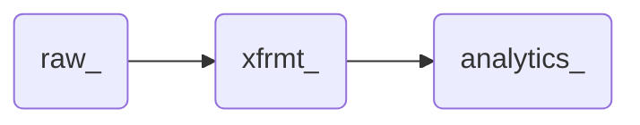

# Creating your database in DB Browser

You've already taken a big step! You've downloaded all the tools you'll need, and have completed a light review of some of the data we will be working with. Now it is time to set up your database in DB Browser.

## Option 1: Manually Import Your Data

Once you've opened DB Browser, you should be greeted with an screen like this:

First, click on `New Database` towards the top left. Once you name and save your database, you may get a new window asking you to edit the table definition. Click `Cancel`.

You may have noticed four new items appear under the Database Structure tab, all of which ending with `(0)`. In a moment, the Tables items will grow to three once we've imported our raw data.

Next, we want to import the `players.csv` file to create our first table. To do this, select `File > Import > Table from CSV file...` and select the `players.csv` file you previously downloaded.

A second window will now open in DB Browser showing you a preview of the data you are about to bring in. The default values should be fine, however, change the **Table name** to `raw_players`. Check your other setting below,  and then select *OK*.

Now you should see that the number of tables in your database has increased to 1 in the Database Structure tab. Under players, you should see your new table named `raw_players`.

Repeat the above steps to import the play-by-play data. The settings to import should be the same, but lets take a moment adjust the table names for these tables as well. "play_by_play" is a lot to type, so lets simplify to naming our tables `raw_pbp2023` and `raw_pbp2024`. These table might take a couple more minutes to load since there is much more data than the players table.

Now your database structure should have three tables: `raw_pbp2022`, `raw_pbp2023`, and `raw_players`. 

## Option 2: Download the database from GitHub

If you do not want to import the data yourself, you can download this [database file](https://github.com/tmolitor002/SQL-for-Data-Viz/releases/download/data/nfl.db) directly, or navigate to the repo's [release page](https://github.com/tmolitor002/SQL-for-Data-Viz/releases/tag/data) and download `nfl.db`. From DB Browser, select the *Open Database* button.

---

Congratulations, you database is now up and running! It should look something like this:

From this point alone you could connect to your database and begin to visualize your data. But then we wouldn't learn much SQL. And certainly you have questions about what is a table, and why we added `raw_` to the start of the table names.

---

# What is a Table?

At its very core, a table in SQL is a dataset laid out in two dimensions. Instead of using columns and rows like in a spreadsheet, a table uses **fields** and **records**. **Fields** run from left-to-right, and are typically distinct types of data. In DB Browser, select the carrot next to `raw_players` to expand the table to see a list of the different fields within the table.

## Fields

`raw_players` has multiple fields including `status`, `display_name`, `first_name`, `last_name`, and more. Typically, fields are named so that users would be able to understand what kind of data is in the field.

Next to the field name, you'll see a Type. In SQL, fields typically have a restriction on what *kind* of data it can contain. This is typically split into three main groups that each have their own sub-types:
- Boolean: Boolean fields are limited to having values of `True` or `False`. These fields don't always make their way to the end consumers of data, but can be great to use in complex logical models.
	- Boolean data often finds its way into Integer fields represented as a `1` for `True` and `0` for `False`.
- Number: Number fields can only contain numbers. Some database engines and number types might have limits on how large or to what precision of a number can be stored.
	- Integer: A **whole** number that does not retain any precision into the decimal points. 
	- Float/Real: A number that includes precision in the decimal points. While any Integer can become a Float/Real number, the reverse not true. Additionally, when a field should only contains integers, using a Float/Real field type will take up more space than necessary
- Text: Text can contain almost any type character, including numbers. Be aware that numbers stored as text cannot be used in math functions, and first need to be converted. Similarly, not all numbers should be used in math operations. For example, it wouldn't make sense to add together a list of zip codes or jersey numbers.
	- Varchar and char: When working with text, you may see fields labeled as either `varchar` or `char`. In this case, `char` simply means *character*, indicating characters outside of numbers can be included in the field. More common is `varchar`, with `var` standing for *variable*, indicating that the number of characters in any given record can vary from record to record.
	- Varchar has become much more common with the general increase in compute power. Char is mainly used now when the amount of memory available was limited, and had the unfortunate side effect of cutting of strings of text that exceeded the character limit of the field

## Records

If the fields in the table identify what type of data is represented in a given column of data, records can be thought of as the data itself. In SQL, a record simply one row of related data points. In the `raw_players` table, each record represents a unique player. Each player has a `first_name`, a `last_name`, a `jersey_number`, and more.

Its important to note that while data often repeats itself within a single field of a table, each record should represent a unique item. We don't have to look too hard to see this in `raw_players`.

In rows 11 and 12, we see two players both named `A.J. Davis`. Both players are retired, have the same value in the various `_name` fields, and are missing birthdays. It isn't until we go further on to see that both players are different heights, have a different value for `current_team` and play different positions where we start to see these are two players who happen to have the same name. Examining the `esb_id` and `gsis_id` field closely also reveals that these are two different players.

## Keys and IDs

IDs are often used in SQL to differentiate between two different records. Imagine if our `raw_players` table only had the `status` and `_name` fields. We wouldn't be able to differentiate one A.J. Davis from the other. 

When working with data, it is considered a best practice to ensure that every table has at least one field that acts as a unique identifier for each record in the table. `raw_players` happens to have two unique ID fields, `gsis_id` and `esb_id`. We will be using `gsis_id` going forward.

If no unique ID exists, there should be a clear combination of fields that creates unique records. This is called a **Composite Key**. If you happen to discover this in practice, you should alert your Database Administrator, and ask for a surrogate key to be created.

When an ID is unique for each record in a table it called a **Primary Key**, often stylized as `PK`. Only one field within a table should be considered a Primary Key.

Primary Keys can come in several forms, such as a unique number or string of text. For example, imagine a table that contains population data for U.S. States. The state abbreviation field can serve as the primary key for that table.

**Surrogate Keys**, often stylized as `SK`, are a subset of Primary Keys. Surrogate Keys are unique for each record in a table, however the sole purpose of a surrogate key is to distinguish records from each other, and there is no useful information about the record can be understood from surrogate key alone. in `raw_players`, `gsis_id` would be considered a surrogate key.

Unlike primary and surrogate keys, **Foreign Keys**, often stylized as `FK`, are not unique to the table. Instead they are fields that contain the primary keys of a record **in another table**. For example, in `raw_pbp2023`, the fields `passer_player_id`, `receiver_player_id`, and `rusher_player_id`, all  contain a foreign key that reference back to the `raw_players` table. Foreign Keys are not required to ever appear in a table, but often do as database administrators attempt to [normalize](https://en.wikipedia.org/wiki/Database_normalization) their datasets.

# Raw_, xfrmt_ and analytics_

When working with and transforming data, it is often helpful to bucket different objects such as tables together. Whether to keep different types of data separate from each other or to keep track of data at different points along its transformation, schemas such as `raw_`, `xfrmt_`, and `analytics_` are often used to group tables and other items together and organized.

There are plenty of schema names that you might come across when working on a project. `dbo` is the standard schema for many database engines unless otherwise specified. Other shops might use `presentation` for the reporting layer that the data viz team accesses. Different teams and organizations will have different schemas and organize their tables in a way that makes sense for them. Different database engines will also have limitation on what names can be used for different schemas. 

One drawback of using SQLite and DB Browser is that there is no support for schemas. Instead, we will simulate the use of schemas by prepending the schema to the table name, as we have already done by adding `raw_` to `players`, `pbp2023`, and `pbp2022` to create `raw_players`, `raw_pbp2023`, and `raw_pbp2022` respectively. We will continue this by prepending `xfrmt_` and `analytics_` to the other tables we create, however it is important to note that in most other database engines, these same tables would be referenced to in *dot notation*, such as `raw.players`, where the text before the "." refers to the schema, and the text after the "." refers to the table within the schema.

As mentioned above, how schemas are used will vary from database to database. In this project, it will be primarily used to indicate where along the ETL pipeline the data is at.

- `raw_`: Represents the raw data in the same form as how we loaded it into the database.
- `xfrmt_`: Represents the data after it has been cleaned and transformed into more useful tables
- `analtyics_`: Represents the layer that a data viz developer would have access to.

---

Up next we will explore the rest of [DB Browser](https://github.com/tmolitor002/SQL-for-Data-Viz/blob/main/Week-1/03-Exploring%20DB%20Browser.md) and write our first SQL statement.
