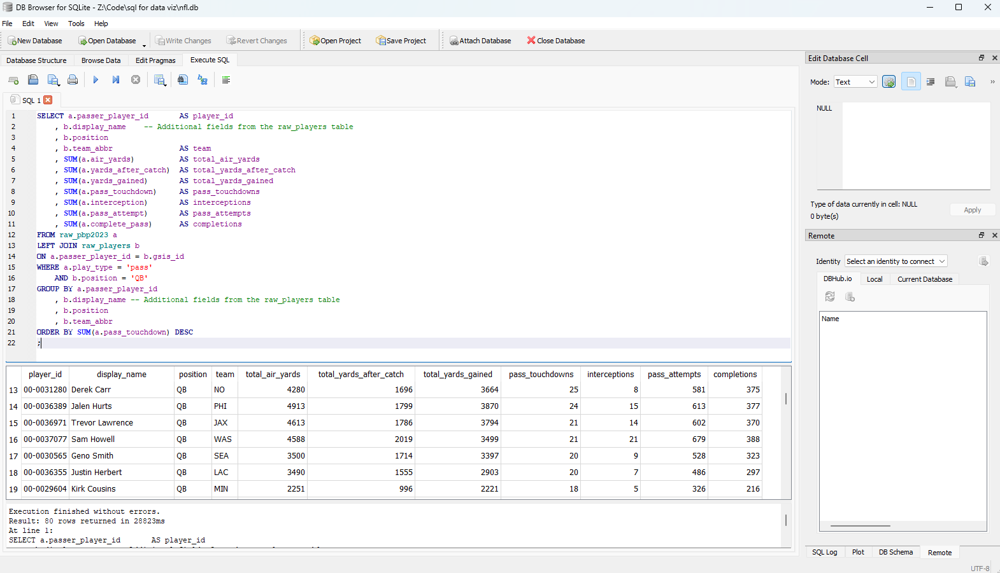

# WITH and UNION

At the end of the lesson on [JOINs](../Week-3/03_01-JOINs.md), we finsished with a query the gave us that season passing stats for quarterbacks in the 2023 season.

<details>
<summary>2023 Passing Query</summary>



```sql
/* 2023 Passing */
SELECT a.passer_player_id       AS player_id
    , b.display_name    -- Additional fields from the raw_players table
    , b.position
    , b.team_abbr               AS team
    , SUM(a.air_yards)          AS total_air_yards
    , SUM(a.yards_after_catch)  AS total_yards_after_catch
    , SUM(a.yards_gained)       AS total_yards_gained
    , SUM(a.pass_touchdown)     AS pass_touchdowns
    , SUM(a.interception)       AS interceptions
    , SUM(a.pass_attempt)       AS pass_attempts
    , SUM(a.complete_pass)      AS completions
FROM raw_pbp2023 a
LEFT JOIN raw_players b
ON a.passer_player_id = b.gsis_id
WHERE a.play_type = 'pass'
    AND b.position = 'QB'
GROUP BY a.passer_player_id
    , b.display_name -- Additional fields from the raw_players table
    , b.position
    , b.team_abbr
ORDER BY SUM(a.pass_touchdown) DESC
;
```

</details>

However this query is only for the 2023 season. This might serve your purpose if you are only interested in the 2023 seaosn, but we also have a similar table, `raw_pbp2022`, which we could use to get similar results for the 2022 season. You could go back even further by [importing](../Week-1/01_02-Starting%20DB%20Browser.md#Option-1:-Manually-Import-Your-Data) additional play-by-play data from [nflverse-data](https://github.com/nflverse/nflverse-data/releases). The same query to get 2022 results requires us to change just one character in our query

```sql
/* 2022 Passing */
SELECT a.passer_player_id       AS player_id
    , b.display_name
    , b.position
    , b.team_abbr               AS team
    , SUM(a.air_yards)          AS total_air_yards
    , SUM(a.yards_after_catch)  AS total_yards_after_catch
    , SUM(a.yards_gained)       AS total_yards_gained
    , SUM(a.pass_touchdown)     AS pass_touchdowns
    , SUM(a.interception)       AS interceptions
    , SUM(a.pass_attempt)       AS pass_attempts
    , SUM(a.complete_pass)      AS completions
FROM raw_pbp2022 a      -- Use 2022 season stats
LEFT JOIN raw_players b
ON a.passer_player_id = b.gsis_id
WHERE a.play_type = 'pass'
    AND b.position = 'QB'
GROUP BY a.passer_player_id
    , b.display_name
    , b.position
    , b.team_abbr
ORDER BY SUM(a.pass_touchdown) DESC
;
```

Notice how the entire query largely remained the same? We were able to do this because the structure and content of the two different play-by-play tables was identical. However, using two separate queries isn't helpful when trying to bring this data into a visualization tool. It would make much more sense to have both 2022 and 2023 statistics in one large table. To do this, we are going to make use of two new functions; the `WITH` expression and the `UNION` clause

## WITH

The `WITH` expression, also known as a Common Table Expression or CTE in SQL, allows us to create a temporary table that exists only while the query is being executed. This is helpful when you want to control the order of operations when transforming your data. When using a CTE, certain clauses such as `ORDER BY` cannot be used, as these clauses are for how the data should be presented, but do not impact how the data should be stored.

To create a CTE, start with a complete and function `SELECT` statement. Before the `SELECT` statement, add `WITH <cte_name> AS (` at the start, and `)` after the statement.

```sql
/* 2023 Passing */

WITH passing_2023 AS (  -- define the name of the CTE, how to construct it
    SELECT a.passer_player_id       AS player_id
        , 2023                      AS season   -- define season
        , b.display_name
        , b.position
        , b.team_abbr               AS team
        , SUM(a.air_yards)          AS total_air_yards
        , SUM(a.yards_after_catch)  AS total_yards_after_catch
        , SUM(a.yards_gained)       AS total_yards_gained
        , SUM(a.pass_touchdown)     AS pass_touchdowns
        , SUM(a.interception)       AS interceptions
        , SUM(a.pass_attempt)       AS pass_attempts
        , SUM(a.complete_pass)      AS completions
    FROM raw_pbp2023 a
    LEFT JOIN raw_players b
    ON a.passer_player_id = b.gsis_id
    WHERE a.play_type = 'pass'
        AND b.position = 'QB'
    GROUP BY a.passer_player_id
        , b.display_name
        , b.position
        , b.team_abbr
)

SELECT *            -- Select all fields...
FROM passing_2023   -- ...from the CTE we defined above
;
```

The last two lines of the above query, `SELECT * FROM passing_2023`, allow us to see the contents of the CTE we created. We could also replace the `*` wildcard with field names and add additional logic to manipulate data containted with the CTE.

Multiple CTEs can be created within the same query. This is accomplished by simply separating each expression with a comma.

```sql
WITH cte1 AS (
    SELECT <statement1>
    FROM <table1>
)

, cte2 AS (
    SELECT <statement2>
    FROM <tables2>
)

...
;
```

## UNION

The `UNION` clause is another way for us to bring data together. Where the `JOIN` clause will add fields from two different tables based on records matching with each other, a `UNION` will stack records from two different tables on top of each other based on both tables having matching field names.

To see this in action, we will create a second cte for 2022 passing, and then add both tables to a `UNION` statement

```sql
WITH passing_2023 AS (  -- 2023 Passing
    SELECT a.passer_player_id       AS player_id
        , 2023                      AS season   -- define season
        , b.display_name
        , b.position
        , b.team_abbr               AS team
        , SUM(a.air_yards)          AS total_air_yards
        , SUM(a.yards_after_catch)  AS total_yards_after_catch
        , SUM(a.yards_gained)       AS total_yards_gained
        , SUM(a.pass_touchdown)     AS pass_touchdowns
        , SUM(a.interception)       AS interceptions
        , SUM(a.pass_attempt)       AS pass_attempts
        , SUM(a.complete_pass)      AS completions
    FROM raw_pbp2023 a
    LEFT JOIN raw_players b
    ON a.passer_player_id = b.gsis_id
    WHERE a.play_type = 'pass'
        AND b.position = 'QB'
    GROUP BY a.passer_player_id
        , b.display_name
        , b.position
        , b.team_abbr
)

, passing_2022 AS (
    SELECT a.passer_player_id       AS player_id
        , 2022                      AS season   -- define season
        , b.display_name
        , b.position
        , b.team_abbr               AS team
        , SUM(a.air_yards)          AS total_air_yards
        , SUM(a.yards_after_catch)  AS total_yards_after_catch
        , SUM(a.yards_gained)       AS total_yards_gained
        , SUM(a.pass_touchdown)     AS pass_touchdowns
        , SUM(a.interception)       AS interceptions
        , SUM(a.pass_attempt)       AS pass_attempts
        , SUM(a.complete_pass)      AS completions
    FROM raw_pbp2022 a
    LEFT JOIN raw_players b
    ON a.passer_player_id = b.gsis_id
    WHERE a.play_type = 'pass'
        AND b.position = 'QB'
    GROUP BY a.passer_player_id
        , b.display_name
        , b.position
        , b.team_abbr
)

SELECT *                -- Select everything...
FROM passing_2023       -- ...From the passing 2023 CTE
UNION                   -- Then add the following selection to it as additional records
SELECT *                -- Select everything...
FROM passing_2022       -- ...From the passing 2023 CTE
;
```

| player_id  | season | display_name  | ... | pass_touchdowns | ... |
| :--------- | -----: | :------------ | :-: | --------------: | :-: |
| 00-0019596 |   2022 | Tom Brady     | ... |              27 | ... |
| 00-0023459 |   2022 | Aaron Rodgers | ... |              26 | ... |
| 00-0023459 |   2023 | Aaron Rodgers | ... |               0 | ... |
| ...        |    ... | ...           | ... |             ... | ... |

While this example only used the `UNION` instruction once to bring two tables together, SQL will allow you to union many more than 2 tables together within the same query.

Do note that while this example used the `*` wildcard to select all fields from both tables, this can easily backfire if the field names are not between all the tables being unioned. The best practice is to list out each field being selected from each table, and ensure they are in the same order withing each SELECT statement.

---

In the [next lesson](./03_04-Project%20Update%20and%20Arithmetic.md), we have a small update to make to the structure of our query, and will dive into how to use arithmetic to manipulate some of the data in the query.
